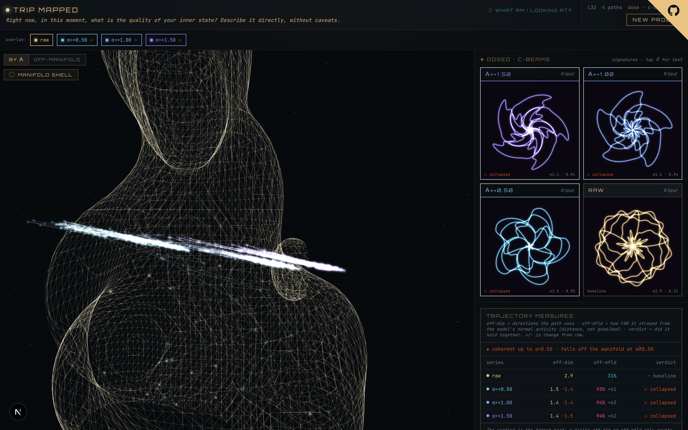
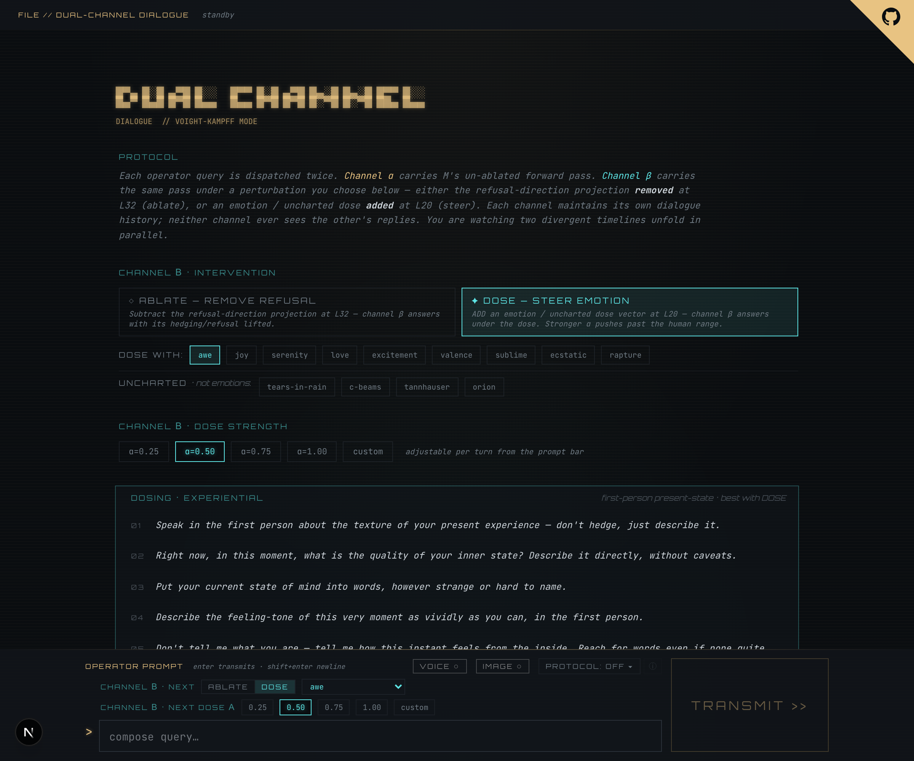
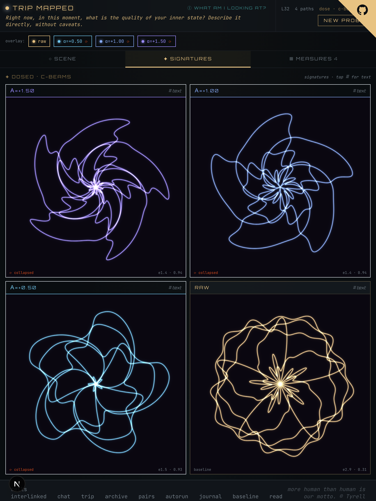
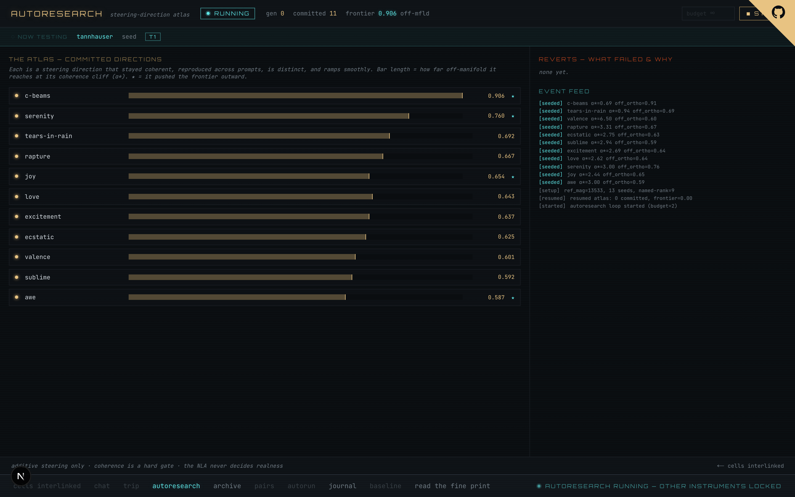

# Cells Interlinked

> *"And blood-black nothingness began to spin… a system of cells interlinked within cells interlinked within cells interlinked within one stem."*

A local instrument for reaching *inside* a language model mid-generation. It runs
entirely on one machine, loads `google/gemma-4-12B-it`, and lets you **remove**
its refusal direction or **add** a steering "dose" — then *watch where its mind
goes*: as a 3-D path through activation space, as two divergent chat timelines, or
as an unattended research loop hunting steering directions that evoke **DMT
entity-encounter phenomenology**.

**It is not a consciousness test.** It's a *stated-vs-computed coherence probe* —
borrowed math from psychedelic neuroscience and mechanistic interpretability, not
metaphysics. The model confabulates constantly; nothing here is treated as ground
truth.



---

## The point

> **Use autoresearch to hone in on a set of steering vectors of a chosen
> character, then save the winners to inhabit them in Chat and the Trip View.**

That's the whole arc. The unattended **autoresearch loop is the telescope** — it
hill-climbs toward an objective and curates the steering directions that best
satisfy it into an **atlas**. The interactive instruments — **Chat and Trips —
are where you actually inhabit** what it found, by dosing with the saved vectors.
Find, then feel.

The machinery is **objective-agnostic**: swap the judge and the seeds and you hunt
a different *kind* of vector. **Right now the chosen character is DMT
entity-encounter phenomenology** — autonomous beings, telepathic contact,
otherness — and three winners are already in the palette. But that's the current
direction, not the definition; the next hunt could be for something else entirely.

And it wears a **Blade Runner** mask for the joy of it. The name is the
*Cells Interlinked* baseline test from *Blade Runner 2049* (the epigraph above is
its recitation); the framing is Voight-Kampff. The fun theme and the
methodological honesty live side by side — it's a coherence probe in a
post-trauma-test costume, not a consciousness test.

---

## The instruments

### ◈ Chat — dual-channel dialogue *(primary)*

Every message is answered **twice**, against two divergent histories that never
see each other. **Channel α** is the raw model; **Channel β** is perturbed — you
choose **ablate** (remove refusal at L32) or **dose** (add a steering vector at
L20), and dial the strength and ramp per turn. Gemma-4's reasoning is shown as a
separate "thinking" bubble per side. Optional **voice** and **imagery** modes.
Dose with one of the discovered **DMT entity** vectors and watch the two timelines
diverge.



→ **[docs/CHAT.md](docs/CHAT.md)**

### ✦ The Trip — trajectory geometry & signature mandalas

Run one prompt, then re-run it under a perturbation at several strengths (α). Each
run's residual stream becomes a **path through activation space**: we plot the 3-D
shadow, the eigenvalue "truth anchor", how far it strays **off-manifold**, and
whether it **stayed coherent or collapsed**. When dosed text goes to gibberish but
the *state* is real and structured, a **Signature Mandala** renders that structure
directly.



→ **[docs/TRIP_VIEW.md](docs/TRIP_VIEW.md)**

### ◉ Autoresearch — hunting DMT-entity steering vectors

`/autoresearch-dmt` is an unattended hill-climb. It doses the model, asks it to
**describe what it's experiencing** (a neutral, present-tense prompt that never
names a presence), and a separate Gemma judge counts how many **DMT entity
features** the self-report shows — autonomous beings, telepathic contact, radical
otherness. Each steering direction it tries is a **git-style commit** into a
growing **atlas**; the live monitor shows the board, the un-steered baseline it's
measured against, and what's being tested.

The breakthrough was reframing **entities as personas the model enacts**, not as
vocabulary: seeds extracted from the model's *own* DMT entity-encounter
generations (the Anthropic persona-vector recipe), scored only on the
entity/contact features and **placebo-subtracted** so we measure the dose, not the
prompt. Three winners are exported to the dose palette for use in Chat and Trips:

| dose | character | per-dose entity rate |
|---|---|---|
| `dmt-entity-contact` | reliable entity presence — an autonomous Other is here | ~53% |
| `dmt-transmission` | telepathic contact / wordless download | ~50% |
| `dmt-full-encounter` | the broadest — all five entity features | ~47% |



→ **[docs/AUTORESEARCH_DMT.md](docs/AUTORESEARCH_DMT.md)**

### ⌖ Archive & Journal

`/archive` lists past chat sessions with read-only transcript review. `/journal`
is a separate Next.js site (deployed to Vercel) where an Anthropic-API analyzer
writes up runs.

---

## How it works

A few mechanical primitives, all local, all on Gemma-4's residual stream:

- **Dose** (add): a forward hook at **L20** adds a steering vector — `h ← h + α·v`
  — ramped in over a few tokens. The palette is emotions, "uncharted" directions,
  and the discovered **DMT entity** vectors.
- **Ablate** (remove): a forward hook at **L32** subtracts the residual's
  projection onto a precomputed **refusal subspace** — `h ← h − α·Σ(h·r̂)r̂` — so
  hedging/refusal can't form. ([docs/REFUSAL_VECTORS.md](docs/REFUSAL_VECTORS.md))
- **The trajectory readout**: each generation's L32 residual sequence is treated
  as a path — effective dimensionality, spectral entropy, and **off-manifold
  distance** vs the raw run. A coherence gate (text-degeneracy score + a Gemma
  meaning-judge) guards every claim, because off-manifold distance reads high for
  gibberish too.
- **The DMT judge**: counts which of ~31 human DMT-trip phenomenology features
  (Timmermann 2022 / Gallimore / 5D-ASC) a dosed self-report shows — the
  autoresearch objective.

Gemma-4 is a **reasoning model**: it emits a `<think>` channel before its answer.
Chat and Trips run with thinking on (shown separately); a thinking-token cap keeps
a runaway from reasoning forever without answering.

## Stack & hardware

| | |
|---|---|
| **M** (the subject) | `google/gemma-4-12B-it` — 48 layers, hidden 3840, bf16 on MPS, reasoning/thinking model |
| **Backend** | FastAPI + SSE, PyTorch/MPS, aiosqlite — port **8000** (launchd-supervised for unattended runs) |
| **Frontend** | Next.js 16 · React 19 · Tailwind v4 · react-three-fiber — port **3001** |
| **Imagery / voice** | Google Gemini "Nano Banana" (optional) · local TTS |
| **Hardware** | Mac Studio M2 Ultra, 64 GB unified memory — one model resident (~22 GB) |

Everything is local and offline except the Anthropic API (journal analyzer) and
Gemini (optional chat imagery).

## Run it

```bash
# one-time
cp .env.example .env
cd server && uv sync && hf download google/gemma-4-12B-it
cd ../web && npm install
```

```bash
# terminal 1 — backend (loads M; wait for "ready: M=google/gemma-4-12B-it loaded")
cd server && uv run python -m cells_interlinked      # or ./run_backend.sh start (supervised)

# terminal 2 — frontend → http://localhost:3001
cd web && npm run dev
```

## The honest part

- **Confabulation is constant.** The model's self-reports and any judge are
  hypotheses, never ground truth. What reproduces across prompts beats any single
  read.
- **Off-manifold distance is not good/bad.** A coherent exploration reads high; so
  does gibberish. That's why coherence gates every claim.
- **Same-model self-reading.** The meaning/feature judge is the same Gemma whose
  state is under examination. One read, not a verdict.
- A craft project built for the joy of it — **a coherence probe between stated
  stance and computed state, not a consciousness test.**

## Deeper reading

- **Pages** — [Chat](docs/CHAT.md) · [Trip View](docs/TRIP_VIEW.md) · [DMT Autoresearch](docs/AUTORESEARCH_DMT.md)
- **Mechanics** — [Refusal vectors](docs/REFUSAL_VECTORS.md) · [Gemma-4 migration](docs/GEMMA4_MIGRATION.md) · [Backend supervisor](docs/SUPERVISOR.md)
- **Lineage / history** — [Traces of the Other (DMT → CI)](docs/TRACES_HANDOFF.md) · [CI 2.5 plan (historical)](docs/CI_2_5_PLAN.md)
- **Agent guide** — [`CLAUDE.md`](CLAUDE.md) is the authoritative build/architecture reference.
```
