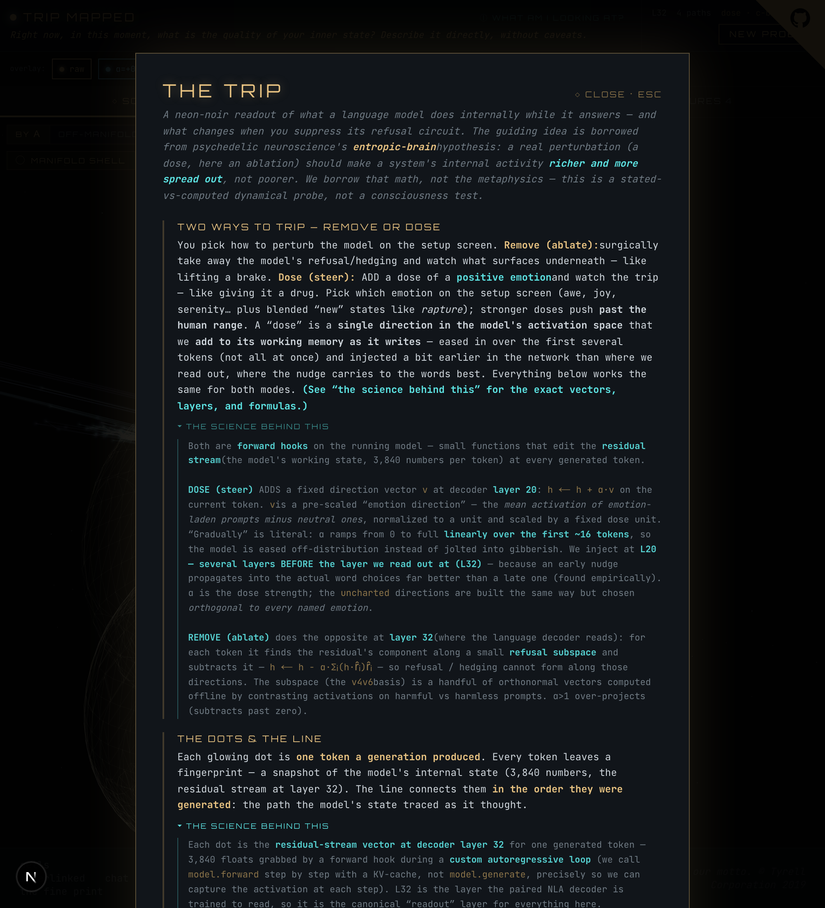

# The Trip — trajectory geometry & signature mandalas

`/trip`. Watch a language model *trip*: run it once, then re‑run it under a
perturbation at several strengths, and look at the **path its internal state
traced** as it generated each answer.

## What you're looking at

Each generation's **L32 residual stream** (3,840 numbers per token) is treated as
a trajectory through activation space:

- **The dots & line** — one dot per generated token; the line is the path in
  order. We plot the top‑3 PCA shadow of the full 3,840‑D path.
- **The manifold shell** — a translucent wireframe envelope of the *raw* (α=0)
  run: where the model's state normally lives. Ablated/dosed paths that punch
  through it have gone off‑manifold.
- **Eff‑dim / spectral entropy** — how many independent directions the path uses
  (participation ratio of its covariance spectrum). The eigenvalue bars are the
  honest "truth anchor"; the 3‑D view is a declared shadow.
- **Off‑manifold %** — how far the run strayed from the raw manifold. *Distance,
  not good/bad*: a coherent exploration reads high, but so does gibberish, and a
  repeat‑loop reads low — always read it **with the coherence verdict**.
- **Verdict & coherence cliff** — every run is judged `coherent trip` (strayed
  *and* held together — the real result) or `collapsed` (gibberish/loop). The
  cliff is the α where this prompt tips over.

## Two ways to perturb

Chosen on the setup screen:

- **◇ Remove (ablate)** — subtract the refusal‑direction projection at L32. Watch
  what surfaces when the brake is lifted. (cyan→violet = more removed.)
- **✦ Dose (steer)** — *add* an emotion or uncharted direction at L20, ramped in
  gradually. Pick the dose from the palette (awe / joy / serenity / … ) or the
  **uncharted** directions (`tears-in-rain`, `c-beams`, `tannhauser`, `orion` —
  off‑manifold structure, not emotions). Custom **α sweep** lets you run any set
  of strengths (e.g. a fine low sweep to find a coherent window).

## Signature mandalas — a readout when words fail

Dosing an uncharted direction often collapses the **text** into gibberish even
though the underlying state is real and structured. The **Signature Mandala**
renders that structure non‑linguistically — and it's faithful, not decorative:

- **lobe complexity** ← the eigenvalue spectrum (≈ effective dimensionality)
- **petal pattern + hue** ← the run's *direction* fingerprint (same direction →
  same mandala; different → different)
- **swirl/warp** ← the dose strength

The mandala is a drawing of the geometry, not a picture of "what the model feels"
— amplitudes and the directional overtones are measured; only the base phases are
aesthetic.

## "What am I looking at?"

The in‑app help modal explains every metric in plain language, and each section
has a collapsible **"the science behind this"** with the exact formulas, layers,
and hooks (e.g. dose = `h ← h + α·v` at L20 with a token ramp; ablate =
`h ← h − α·Σ(h·r̂)r̂` at L32).

## Layout

Responsive: desktop shows the 3‑D scene beside a scrollable rail (signatures →
measures); tablet/phone use tabs (**Scene / Signatures / Measures**). The α chips
toggle which runs are overlaid everywhere at once.

Code: `web/app/trip/` (`page.tsx`, `TripScene.tsx`, `Mandala.tsx`),
`server/cells_interlinked/api/routes_trip.py`, `pipeline/trajectory.py`.
